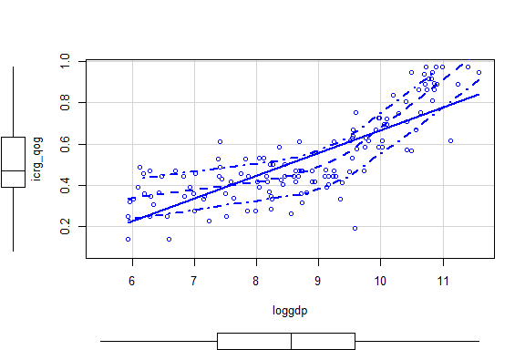

# Find Dataset

Think about your interests. Following are few examples of potential data sources:

## General

* [ICPSR](https://www.icpsr.umich.edu/icpsrweb/ICPSR/index.jsp): You may need to create 
the account with UC Davis E-mail Address to download data.
* [Link List of Public Data](https://github.com/erikgahner/PolData)

## Comparative

* [Correlates of War](http://www.correlatesofwar.org)
* [Polity IV](http://www.systemicpeace.org/inscrdata.html)
* [Varieties of Democracy](https://www.v-dem.net/en/)
* [Quality of Government](https://qog.pol.gu.se/data)
* [World Bank](https://data.worldbank.org)
* [IMF](https://www.imf.org/en/Data)
* [World Value Survey](http://www.worldvaluessurvey.org/wvs.jsp)
* [Comparative Study of Electoral Systems](http://www.cses.org)
* [Manifesto Project](https://manifestoproject.wzb.eu)

## American

* [American National Election Study (ANES)](https://electionstudies.org)
* [Cooperative Congressional Election Study (CCES)](https://cces.gov.harvard.edu/pages/welcome-cooperative-congressional-election-study)
* [General Social Survey](http://gss.norc.org)
* [Correlates of State Policy](http://ippsr.msu.edu/public-policy/correlates-state-policy)
* [Legislative Effectiveness](https://thelawmakers.org/data-download)

# Preparing R Environment


```r
## Clear Workspace
rm(list = ls())

## Set Working Directory to the File location
## (If using RStudio, can be set automatically)
setwd(dirname(rstudioapi::getActiveDocumentContext()$path))
getwd()
```

```
## [1] "C:/GoogleDrive/Lectures/2019_01to03_UCD/POL212_TA/POL212_TA_resource"
```

```r
## Load Relevant Packages (Install if not Installed)
#install.packages("foreign")
# Data Importing
library(foreign) # Stata 12 or Later
library(readstata13) # For Stata 13 Data or Later
library(haven)
library(readr)
# Data Visualization
library(car)
library(lattice)
library(ggplot2)
```


# Practice Loading Data


```r
## Online Location Quality of Government Data 
# CSV
```


```r
csvloc <- "http://www.qogdata.pol.gu.se/data/qog_bas_cs_jan18.csv"
# STATA
```


```r
dtaloc <- "http://www.qogdata.pol.gu.se/data/qog_bas_cs_jan18.dta"
# SPSS
```


```r
savloc <- "http://www.qogdata.pol.gu.se/data/qog_bas_cs_jan18.sav"
```

```r
## Basic Import Commands
# CSV (don't require any package)
d1 <- read.csv(csvloc, stringsAsFactors = FALSE)
# Stata 12 or Before (foreign package)
d2a <- read.dta(dtaloc, convert.factors = FALSE)
# Stata 13 or Later (readstata13 package)
d2b <- read.dta13(dtaloc, convert.factors = FALSE)
# SPSS (may not work with some new format)
d3 <- read.spss(savloc, use.value.labels = FALSE, to.data.frame = TRUE)

## More Advanced Import Commands
# CSV (readr package)
d4 <- read_csv(csvloc)
```

```
## Parsed with column specification:
## cols(
##   .default = col_double(),
##   ccode = col_integer(),
##   cname = col_character(),
##   ccodealp = col_character(),
##   ccodecow = col_integer(),
##   ccodewb = col_integer(),
##   version = col_character(),
##   bti_aar = col_integer(),
##   bti_acp = col_integer(),
##   bti_aod = col_integer(),
##   bti_cdi = col_integer(),
##   bti_ci = col_integer(),
##   bti_cr = col_integer(),
##   bti_eo = col_integer(),
##   bti_eos = col_integer(),
##   bti_ep = col_integer(),
##   bti_ffe = col_integer(),
##   bti_foe = col_integer(),
##   bti_ij = col_integer(),
##   bti_muf = col_integer(),
##   bti_pdi = col_integer()
##   # ... with 98 more columns
## )
```

```
## See spec(...) for full column specifications.
```

```r
# Stata (haven package)
d5 <- read_stata(dtaloc)
#d5 <- read_dta(dtaloc)
# SPSS (haven package)
d6 <- read_spss(savloc)
#d6 <- read_sav(savloc)

## Check Format Differences
# CSV (base vs readr)
head(d1[,seq(1,5,1)])
```

```
##   ccode               cname ccodealp ccodecow ccodewb
## 1     4         Afghanistan      AFG      700       4
## 2     8             Albania      ALB      339       8
## 3    12             Algeria      DZA      615      12
## 4    20             Andorra      AND      232      20
## 5    24              Angola      AGO      540      24
## 6    28 Antigua and Barbuda      ATG       58      28
```

```r
class(d1)
```

```
## [1] "data.frame"
```

```r
head(d4[,seq(1,5,1)])
```

```
## # A tibble: 6 x 5
##   ccode cname               ccodealp ccodecow ccodewb
##   <int> <chr>               <chr>       <int>   <int>
## 1     4 Afghanistan         AFG           700       4
## 2     8 Albania             ALB           339       8
## 3    12 Algeria             DZA           615      12
## 4    20 Andorra             AND           232      20
## 5    24 Angola              AGO           540      24
## 6    28 Antigua and Barbuda ATG            58      28
```

```r
class(d4)
```

```
## [1] "tbl_df"     "tbl"        "data.frame"
```

```r
# Stata (foreign)
head(d2b[,seq(1,5,1)])
```

```
##   ccode               cname ccodealp ccodecow ccodewb
## 1     4         Afghanistan      AFG      700       4
## 2     8             Albania      ALB      339       8
## 3    12             Algeria      DZA      615      12
## 4    20             Andorra      AND      232      20
## 5    24              Angola      AGO      540      24
## 6    28 Antigua and Barbuda      ATG       58      28
```

```r
attr(d2b,"var.labels")[1:5]
```

```
## [1] "Country Code"            "Country Name"           
## [3] "3-letter Country Code"   "Country Code COW"       
## [5] "Country Code World Bank"
```

```r
attr(d2b,"val.labels")[1:5]
```

```
##                
## "" "" "" "" ""
```

```r
# Stata (haven)
head(d5[,seq(1,5,1)])
```

```
## # A tibble: 6 x 5
##   ccode cname               ccodealp ccodecow ccodewb
##   <dbl> <chr>               <chr>       <dbl>   <dbl>
## 1     4 Afghanistan         AFG           700       4
## 2     8 Albania             ALB           339       8
## 3    12 Algeria             DZA           615      12
## 4    20 Andorra             AND           232      20
## 5    24 Angola              AGO           540      24
## 6    28 Antigua and Barbuda ATG            58      28
```

```r
lapply(d5, function(x) attr(x,"label"))[1:5]
```

```
## $ccode
## [1] "Country Code"
## 
## $cname
## [1] "Country Name"
## 
## $ccodealp
## [1] "3-letter Country Code"
## 
## $ccodecow
## [1] "Country Code COW"
## 
## $ccodewb
## [1] "Country Code World Bank"
```

```r
# SPSS (foreign)
head(d3[,seq(1,5,1)])
```

```
##   ccode               cname ccodealp ccodecow ccodewb
## 1     4         Afghanistan      AFG      700       4
## 2     8             Albania      ALB      339       8
## 3    12             Algeria      DZA      615      12
## 4    20             Andorra      AND      232      20
## 5    24              Angola      AGO      540      24
## 6    28 Antigua and Barbuda      ATG       58      28
```

```r
attr(d3,"var.labels")[1:5]
```

```
## NULL
```

```r
attr(d3,"val.labels")[1:5]
```

```
## NULL
```

```r
# SPSS (haven)
head(d6[,seq(1,5,1)])
```

```
## # A tibble: 6 x 5
##   ccode cname               ccodealp ccodecow ccodewb
##   <dbl> <chr>               <chr>       <dbl>   <dbl>
## 1     4 Afghanistan         AFG           700       4
## 2     8 Albania             ALB           339       8
## 3    12 Algeria             DZA           615      12
## 4    20 Andorra             AND           232      20
## 5    24 Angola              AGO           540      24
## 6    28 Antigua and Barbuda ATG            58      28
```

```r
lapply(d6, function(x) attr(x,"label"))[1:5]
```

```
## $ccode
## [1] "Country Code"
## 
## $cname
## [1] "Country Name"
## 
## $ccodealp
## [1] "3-letter Country Code"
## 
## $ccodecow
## [1] "Country Code COW"
## 
## $ccodewb
## [1] "Country Code World Bank"
```


# Histogram


```r
with(d1, hist(icrg_qog, breaks=10, col="gray",
              xlab="Quality of Government (ICRG)"))
```


```r
with(d1, hist(wdi_gdpcapcon2010, breaks="FD",col="gray",
              xlab="GDP per Capita (2010)"))
```


# Scatter Plot


```r
# Basic Plot
```

```r
X <- d1$wdi_gdpcapcon2010
Y <- d1$icrg_qog
plot(X,Y, main="Quality of Government (ICRG)", xlab="GDP Per Capita", ylab="Butthead")
abline(lm(Y ~ X), col="red1")
```


```r
# LOWESS scatter plot smoothing
d1x <- na.omit(d1[,c("wdi_gdpcapcon2010","icrg_qog")]) # Eliminate NAs
```

```r
with(d1x, plot(wdi_gdpcapcon2010, icrg_qog))
with(d1x, lines(lowess(wdi_gdpcapcon2010, icrg_qog)))
with(d1x, lines(lowess(wdi_gdpcapcon2010, icrg_qog, f=1/10), col="red1"))
```


```r
# Using car
```

```r
scatterplot(icrg_qog ~ wdi_gdpcapcon2010, data=d1,
            smooth=list(span=0.6, lwd=3, lwd.var=2))
```


```r
# Scatter Plot Matrix by QoG, GDP per capita, and Human Capital Index
```

```r
scatterplotMatrix(~ icrg_qog + wdi_gdpcapcon2010 + pwt_hci, data=d1)
```


```r
# Using ggplot2
```

```r
ggplot(d1, aes(x=wdi_gdpcapcon2010, y=icrg_qog)) + geom_point() + 
  xlab("GDP per Capita") + ylab("Quality of Government") + 
  geom_smooth(method="lm", aes(color="Linear")) + 
  geom_smooth(method="loess", aes(color="LOWESS")) +
  scale_color_manual(name="Smoother", values=c("blue","red")) + 
  theme_bw()
```

```
## Warning: Removed 59 rows containing non-finite values (stat_smooth).

## Warning: Removed 59 rows containing non-finite values (stat_smooth).
```

```
## Warning: Removed 59 rows containing missing values (geom_point).
```


# Boxplot


```r
# Single Boxplot
```

```r
Boxplot(~icrg_qog, data=d1)
```


```r
# By Electoral System
table(d1$iaep_es)
```

```
## 
##  1  2  3  4 
## 18 34 57 43
```

```r
table(d1$iaep_es)/sum(table(d1$iaep_es))
```

```
## 
##         1         2         3         4 
## 0.1184211 0.2236842 0.3750000 0.2828947
```

```r
# 1 = Plurarity
# 2 = Majority
# 3 = Proportional Representation
# 4 = Mixed
```

```r
Boxplot(icrg_qog~iaep_es, data=d1, 
        xlab="Electoral System",
        ylab="Quality of Government")
```


```
## [1] "127" "185" "187" "31"  "156" "169"
```

```r
# Transform Value Labels
```

```r
d1$eslab <- factor(d1$iaep_es,
                   levels = seq(1,4,1),
                   labels = c("Plurarity","Majority","PR","Mixed"))
```

```r
Boxplot(icrg_qog~eslab, data=d1, 
        xlab="Electoral System",
        ylab="Quality of Government")
```


```
## [1] "127" "185" "187" "31"  "156" "169"
```

```r
# ggplot2
d1y <- na.omit(d1[,c("icrg_qog","eslab")])
```

```r
ggplot(d1y, aes(x=eslab, y=icrg_qog)) + geom_boxplot() + 
  xlab("GDP per Capita") + ylab("Quality of Government") + 
  theme_bw()
```


# Transformation 


```r
# Logarithm Transformation
d1$loggdp <- log(d1$wdi_gdpcapcon2010)

# Compare Histograms
```

```r
with(d1, hist(wdi_gdpcapcon2010, breaks=10, col="gray"))
```


```r
with(d1, hist(loggdp, breaks="FD",col="gray"))
```


```r
# Scatter Plot
```

```r
scatterplot(icrg_qog ~ loggdp, span=0.6,
            lwd=3, id.n=4, data=d1)
```

```
## Warning in plot.window(...): "span" is not a graphical parameter
```

```
## Warning in plot.window(...): "id.n" is not a graphical parameter
```

```
## Warning in plot.xy(xy, type, ...): "span" is not a graphical parameter
```

```
## Warning in plot.xy(xy, type, ...): "id.n" is not a graphical parameter
```

```
## Warning in axis(side = side, at = at, labels = labels, ...): "span" is not
## a graphical parameter
```

```
## Warning in axis(side = side, at = at, labels = labels, ...): "id.n" is not
## a graphical parameter
```

```
## Warning in axis(side = side, at = at, labels = labels, ...): "span" is not
## a graphical parameter
```

```
## Warning in axis(side = side, at = at, labels = labels, ...): "id.n" is not
## a graphical parameter
```

```
## Warning in box(...): "span" is not a graphical parameter
```

```
## Warning in box(...): "id.n" is not a graphical parameter
```

```
## Warning in title(...): "span" is not a graphical parameter
```

```
## Warning in title(...): "id.n" is not a graphical parameter
```



```r
# Scatter Plot Matrix by QoG, GDP per capita, and Logged GDP per Capita
```

```r
scatterplotMatrix(~ icrg_qog + wdi_gdpcapcon2010 + loggdp, data=d1)
```


```r
# ggplot2
```

```r
ggplot(d1, aes(x=loggdp, y=icrg_qog)) + geom_point() + 
  xlab("GDP per Capita") + ylab("Quality of Government") + 
  geom_smooth(method="lm", aes(color="Linear")) + 
  geom_smooth(method="loess", aes(color="LOWESS")) +
  scale_color_manual(name="Smoother", values=c("blue","red")) + 
  theme_bw()
```

```
## Warning: Removed 59 rows containing non-finite values (stat_smooth).

## Warning: Removed 59 rows containing non-finite values (stat_smooth).
```

```
## Warning: Removed 59 rows containing missing values (geom_point).
```


---
title: "TA_session_011619.R"
author: "Gento-K"
date: "Wed Jan 16 15:59:48 2019"
---
