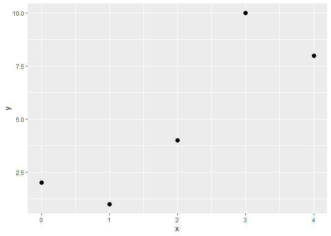
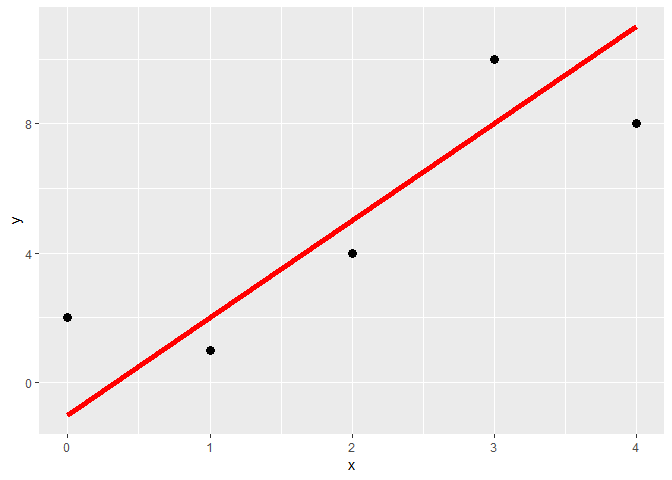
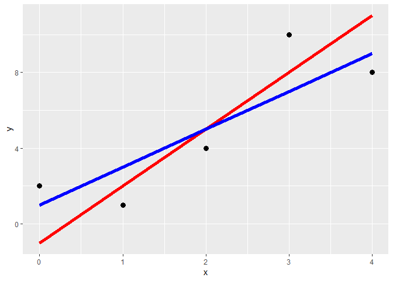
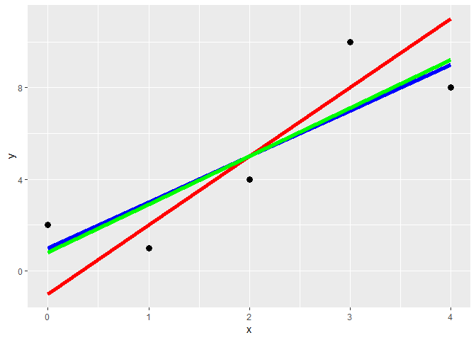

POL212 TA Session
================
Gento Kato
January 30, 2019

``` r
## Clear Workspace
rm(list = ls())

## Set Working Directory to the File location
## (If using RStudio, can be set automatically)
setwd(dirname(rstudioapi::getActiveDocumentContext()$path))
getwd()
```

    ## [1] "C:/GoogleDrive/Lectures/2019_01to03_UCD/POL212_TA/POL212_TA_resource"

``` r
## Required Package
library(ggplot2)
```

OLS Calculation in R
====================

**Note that in HW, you need to show your work (by typing of hand-writing steps in calcuation), NOT R codes**

Simple Example of Linear Regression
-----------------------------------

``` r
# Create Data
(d <- data.frame(y = c(2, 1, 4, 10, 8),
                x = c(0, 1, 2, 3,  4) ))
```

    ##    y x
    ## 1  2 0
    ## 2  1 1
    ## 3  4 2
    ## 4 10 3
    ## 5  8 4

``` r
# Plot
(p <- ggplot(d, aes(x,y)) + geom_point(size=3))
```



``` r
# Linear Prediction 1 (alpha=-1, beta=3)
(d$yh1 <- (-1 + 3 * d$x))
```

    ## [1] -1  2  5  8 11

``` r
(p <- p + geom_line(data=d,aes(x=x,y=yh1),size=2,color="red"))
```



``` r
# Linear Prediction 2 (alpha=1, beta=2)
(d$yh2 <- (1 + 2 * d$x))
```

    ## [1] 1 3 5 7 9

``` r
(p <- p + geom_line(data=d,aes(x=x,y=yh2),size=2,color="blue"))
```



``` r
# Calculate The Sum of Squared Residuals (SSE)
# For yh1
(step1 <- d$yh1 - d$y)
```

    ## [1] -3  1  1 -2  3

``` r
(step2 <- step1^2)
```

    ## [1] 9 1 1 4 9

``` r
(yh1sse <- sum(step2))
```

    ## [1] 24

``` r
# For yh2
(step1 <- d$yh2 - d$y)
```

    ## [1] -1  2  1 -3  1

``` r
(step2 <- step1^2)
```

    ## [1] 1 4 1 9 1

``` r
(yh2sse <- sum(step2))
```

    ## [1] 16

``` r
# yh2 has smaller SSE than yh1
yh1sse > yh2sse
```

    ## [1] TRUE

Verify OLS Estimates
====================

Practice of Writing Functions

``` r
# Calculate Beta Hat (Coefficient)
betah <- function(y,x){ # two arguments, y and x
  n <- length(y) # Number of Cases
  xi.xb <- rep(NA, n) # Xi - Xbar Placeholder
  yi.yb <- rep(NA, n) # yi - ybar Placeholder
  # Calculate xi-xbar and yi-ybar for each case
  for (i in 1:n){
    xi.xb[i] <- x[i] - mean(x)
    yi.yb[i] <- y[i] - mean(y)
  }
  # Calculate Beta Hat
  betah <- sum(xi.xb * yi.yb)/sum(xi.xb^2)
  return(betah)
}

# Calculate Alpha Hat (Intercept)
alphah <- function(y,x,betah) { # three arguments, y, x, betah 
  mean(y) - betah * mean(x)
}

# USE THE EXAMPLE DATA TO CALCULATE BETA HAT and ALPHA HAT
(b_est <- betah(y = d$y, x = d$x))
```

    ## [1] 2.1

``` r
(a_est <- alphah(y = d$y, x = d$x, betah = b_est))
```

    ## [1] 0.8

``` r
# Store the estimate in data & plot
yh <- function(y, x){
  b_est <- betah(y, x)
  a_est <- alphah(y, x, b_est)
  return(a_est + b_est * d$x)
}
(d$yhOLS <- yh(d$y, d$x))
```

    ## [1] 0.8 2.9 5.0 7.1 9.2

``` r
(p <- p + geom_line(data=d,aes(x=x,y=yhOLS),size=2,color="green"))
```



``` r
# Residuals Standard Error 
residualSE <- function(y, x){
  df <- length(y) - 2 # Degrees of Freedom 
  cat(paste("Step 0: Degrees of Freedom (DF) = n-p-1 =", df))
  y_est <- yh(y, x)
  step1 <- y - y_est
  cat("Step 1: y - yhat:\n")
  cat(step1)
  cat("\n\n")
  step2 <- step1^2
  cat("Step 2: (y - yhat)^2:\n")
  cat(step2)
  cat("\n\n")
  step3 <- sum(step2)/df 
  cat(paste("Step 3: sum((y - yhat)^2)/(DF):\n", step3, "\n\n"))
  res <- sqrt(step3)
  cat(paste("End: sqrt(sum((y - yhat)^2)/(DF)):\n", res, "\n\n"))
  return(res)
}
residualSE(d$y, d$x)
```

    ## Step 0: Degrees of Freedom (DF) = n-p-1 = 3Step 1: y - yhat:
    ## 1.2 -1.9 -1 2.9 -1.2
    ## 
    ## Step 2: (y - yhat)^2:
    ## 1.44 3.61 1 8.41 1.44
    ## 
    ## Step 3: sum((y - yhat)^2)/(DF):
    ##  5.3 
    ## 
    ## End: sqrt(sum((y - yhat)^2)/(DF)):
    ##  2.30217288664427

    ## [1] 2.302173

``` r
# OR JUST
sqrt(sum((d$y - yh(d$y,d$x))^2)/(length(d$y)-2))
```

    ## [1] 2.302173

``` r
# Total Sum of Squares (TSS)
(TSS <- sum((d$y-mean(d$y))^2))
```

    ## [1] 60

``` r
# Residual Sum of Squares(RSS)
(RSS <- sum((d$y-yh(d$y, d$x))^2))
```

    ## [1] 15.9

``` r
# Regression Sum of Squares (RegSS)
# (Also called Explained Sum of Squares ESS)
(RegSS <- sum((yh(d$y, d$x) - mean(d$y))^2))
```

    ## [1] 44.1

``` r
# Confirm that RegSS + RSS = TSS
RegSS + RSS 
```

    ## [1] 60

``` r
TSS
```

    ## [1] 60

``` r
# Rsquared 
RegSS/TSS
```

    ## [1] 0.735

``` r
1 - RSS/TSS
```

    ## [1] 0.735

``` r
# You can also write a function
Rsq <- function(y, x){
  TSS <- sum((y-mean(y))^2)
  RSS <- sum((y-yh(y, x))^2)
  RegSS <- sum((yh(y, x) - mean(y))^2)
  Rsq <- RegSS/TSS
  res <- c(TSS,RSS,RegSS,Rsq)
  names(res) <- c("TSS", "RSS","RegSS|ESS","R squared")
  return(res)
}
Rsq(d$y, d$x)
```

    ##       TSS       RSS RegSS|ESS R squared 
    ##    60.000    15.900    44.100     0.735

``` r
# Summary Function
sum_est <- function(y, x){
  b_est <- betah(y, x)
  a_est <- alphah(y, x, b_est)
  residualSE <- sqrt(sum((y - yh(y,x))^2)/(length(y)-2))
  coefs <- c(a_est,b_est,residualSE)
  names(coefs) <- c("Intercept","Coefficient", "Residual SE")
  rsqs <- Rsq(y, x)
  res <- list(coefs, rsqs)
  names(res) <- c("Estiamtes", "Goodness of Fit")
  return(res)
}
sum_est(d$y, d$x)
```

    ## $Estiamtes
    ##   Intercept Coefficient Residual SE 
    ##    0.800000    2.100000    2.302173 
    ## 
    ## $`Goodness of Fit`
    ##       TSS       RSS RegSS|ESS R squared 
    ##    60.000    15.900    44.100     0.735

``` r
# Check by R's Default Linear Regression Function
summary(lm(y~x, data=d))
```

    ## 
    ## Call:
    ## lm(formula = y ~ x, data = d)
    ## 
    ## Residuals:
    ##    1    2    3    4    5 
    ##  1.2 -1.9 -1.0  2.9 -1.2 
    ## 
    ## Coefficients:
    ##             Estimate Std. Error t value Pr(>|t|)  
    ## (Intercept)    0.800      1.783   0.449   0.6841  
    ## x              2.100      0.728   2.885   0.0633 .
    ## ---
    ## Signif. codes:  0 '***' 0.001 '**' 0.01 '*' 0.05 '.' 0.1 ' ' 1
    ## 
    ## Residual standard error: 2.302 on 3 degrees of freedom
    ## Multiple R-squared:  0.735,  Adjusted R-squared:  0.6467 
    ## F-statistic: 8.321 on 1 and 3 DF,  p-value: 0.06329
