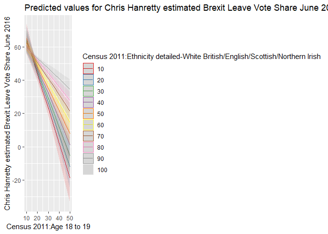
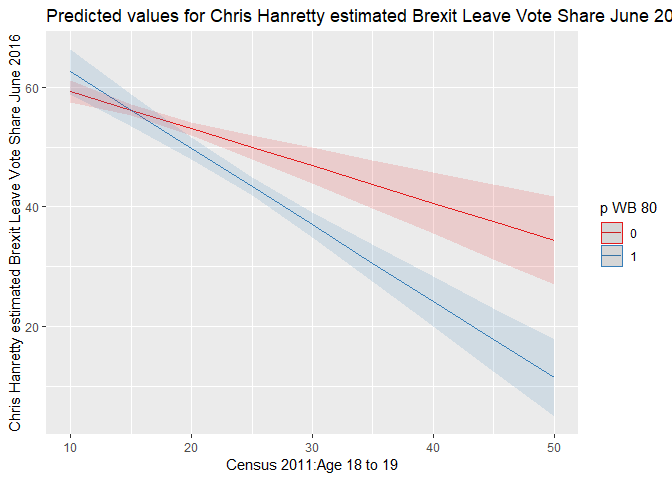
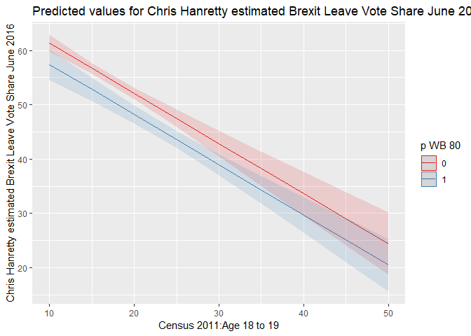
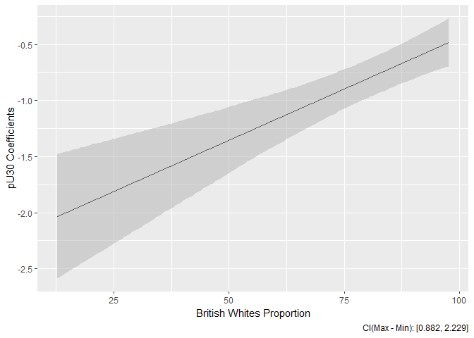

POL212 TA Session
================
Gento Kato
February 13, 2019

``` r
## Clear Workspace
rm(list = ls())

## Set Working Directory to the File location
## (If using RStudio, can be set automatically)
setwd(dirname(rstudioapi::getActiveDocumentContext()$path))
getwd()
```

    ## [1] "C:/GoogleDrive/Lectures/2019_01to03_UCD/POL212_TA/POL212_TA_resource"

``` r
## Required Package
library(readstata13)
library(haven)
```

Practice of Analysis
====================

1.  Download **BRITISH GENERAL ELECTION CONSTITUENCY RESULTS 2010-2017, V1.2** from [HERE](https://www.pippanorris.com/data/). (Choose Any Version You Want)

2.  Open Data in R

``` r
# I chose stata version

# Set Data Location (Set on your own)
dataloc <- "D:/BoxSync/Data/UK_votes/data/UK GE 2010_2015_2017 V1_2 (+Brexit vote).dta"

# Load Data
d <- read.dta13(dataloc, convert.factors = FALSE)
# OR
d <- read_dta(dataloc)
```

1.  Check the codebook (available at the same website). Find following variables in data.

-   % of Brexit "Leave" Vote in the District (2016)
-   Vote Share of Liberal Democratic Party (2015)
-   Proportion of Female (2011)
-   Proportion of Whites who are British (2011)

Check the distribution by summary() function.

``` r
summary(d$BREXITLeave)
```

    ##    Min. 1st Qu.  Median    Mean 3rd Qu.    Max.    NA's 
    ##   18.48   45.36   53.77   52.11   60.18   74.96      18

``` r
summary(d$LD15)
```

    ##    Min. 1st Qu.  Median    Mean 3rd Qu.    Max.    NA's 
    ##   0.700   3.000   4.600   7.823   8.600  51.500      19

``` r
summary(d$c11Female)
```

    ##    Min. 1st Qu.  Median    Mean 3rd Qu.    Max.    NA's 
    ##   46.95   50.57   50.98   50.93   51.39   53.14      18

``` r
summary(d$c11EthnicityWhiteBritish)
```

    ##    Min. 1st Qu.  Median    Mean 3rd Qu.    Max.    NA's 
    ##   12.71   79.97   90.68   83.01   95.04   97.79      18

1.  Create a new data.frame including all the above variables. Also, add following Variable by transoforming relevant variables in the original data.

-   Proportion of Younger than Age 30 in the Population of Age 18 or Older (2011)

``` r
# Initiate Data.Frame with No Columns, but same number of rows as d
dnew <- d[,FALSE]
dnew$leave <- d$BREXITLeave
dnew$LD15 <- d$LD15
dnew$pFEM <- d$c11Female
dnew$pWB <- d$c11EthnicityWhiteBritish
pU18 <- d$c11Age0to4 + d$c11Age10to14 + d$c11Age15 + 
  d$c11Age16to17
p1830 <- d$c11Age18to19 + d$c11Age20to24 + d$c11Age25to29
dnew$pU30 <- (p1830 / (100 - pU18))*100
summary(dnew$pU30)
```

    ##    Min. 1st Qu.  Median    Mean 3rd Qu.    Max.    NA's 
    ##   10.75   14.87   17.41   18.88   20.73   48.74      18

``` r
dim(dnew)
```

    ## [1] 650   5

1.  Compare means of Brexit vote proportion by Following two groups

-   Proportion of Age &lt;30 is larger than 20%
-   Proportion of Age &lt;30 is 20% or lower Interpretation?

``` r
with(dnew, t.test(leave[pU30>20],leave[pU30<=20]))
```

    ## 
    ##  Welch Two Sample t-test
    ## 
    ## data:  leave[pU30 > 20] and leave[pU30 <= 20]
    ## t = -9.7926, df = 255.62, p-value < 2.2e-16
    ## alternative hypothesis: true difference in means is not equal to 0
    ## 95 percent confidence interval:
    ##  -12.452005  -8.282339
    ## sample estimates:
    ## mean of x mean of y 
    ##  44.73325  55.10042

1.  Run OLS regression to test the hypothesis that larger the proportion of voters who are age 30 or younger, lower the proporition of Brexit votes. Run two models:

-   Bivariate regression with only one variable
-   Multiple Regression with control variables

Interpreations?

``` r
# Conventional Way
m1 <- lm(leave ~ pU30, data=dnew)
m2 <- lm(leave ~ pU30 + LD15 + pFEM + pWB, data=dnew)
# Show Summary
summary(m1)
```

    ## 
    ## Call:
    ## lm(formula = leave ~ pU30, data = dnew)
    ## 
    ## Residuals:
    ##      Min       1Q   Median       3Q      Max 
    ## -30.4120  -7.0182   0.5273   7.1638  21.5874 
    ## 
    ## Coefficients:
    ##             Estimate Std. Error t value Pr(>|t|)    
    ## (Intercept)  67.5955     1.3548   49.90   <2e-16 ***
    ## pU30         -0.8200     0.0684  -11.99   <2e-16 ***
    ## ---
    ## Signif. codes:  0 '***' 0.001 '**' 0.01 '*' 0.05 '.' 0.1 ' ' 1
    ## 
    ## Residual standard error: 10.3 on 630 degrees of freedom
    ##   (18 observations deleted due to missingness)
    ## Multiple R-squared:  0.1858, Adjusted R-squared:  0.1845 
    ## F-statistic: 143.7 on 1 and 630 DF,  p-value: < 2.2e-16

``` r
summary(m2)
```

    ## 
    ## Call:
    ## lm(formula = leave ~ pU30 + LD15 + pFEM + pWB, data = dnew)
    ## 
    ## Residuals:
    ##      Min       1Q   Median       3Q      Max 
    ## -28.3715  -6.1869   0.4828   6.3862  22.8976 
    ## 
    ## Coefficients:
    ##              Estimate Std. Error t value Pr(>|t|)    
    ## (Intercept) 239.09901   28.83682   8.291 6.85e-16 ***
    ## pU30         -0.80237    0.08606  -9.324  < 2e-16 ***
    ## LD15         -0.34843    0.04493  -7.755 3.61e-14 ***
    ## pFEM         -3.59509    0.55304  -6.501 1.64e-10 ***
    ## pWB           0.16851    0.02584   6.520 1.45e-10 ***
    ## ---
    ## Signif. codes:  0 '***' 0.001 '**' 0.01 '*' 0.05 '.' 0.1 ' ' 1
    ## 
    ## Residual standard error: 9.393 on 626 degrees of freedom
    ##   (19 observations deleted due to missingness)
    ## Multiple R-squared:  0.3274, Adjusted R-squared:  0.3231 
    ## F-statistic: 76.18 on 4 and 626 DF,  p-value: < 2.2e-16

``` r
# You can also compare with NULL Model
m0 <- lm(leave ~ 1, data=dnew)
var.test(m0,m1)
```

    ## 
    ##  F test to compare two variances
    ## 
    ## data:  m0 and m1
    ## F = 1.2262, num df = 631, denom df = 630, p-value = 0.01057
    ## alternative hypothesis: true ratio of variances is not equal to 1
    ## 95 percent confidence interval:
    ##  1.048807 1.433558
    ## sample estimates:
    ## ratio of variances 
    ##           1.226189

``` r
library(texreg)
screenreg(list(m1,m2)) # in R console
```

    ## 
    ## ===================================
    ##              Model 1     Model 2   
    ## -----------------------------------
    ## (Intercept)   67.60 ***  239.10 ***
    ##               (1.35)     (28.84)   
    ## pU30          -0.82 ***   -0.80 ***
    ##               (0.07)      (0.09)   
    ## LD15                      -0.35 ***
    ##                           (0.04)   
    ## pFEM                      -3.60 ***
    ##                           (0.55)   
    ## pWB                        0.17 ***
    ##                           (0.03)   
    ## -----------------------------------
    ## R^2            0.19        0.33    
    ## Adj. R^2       0.18        0.32    
    ## Num. obs.    632         631       
    ## RMSE          10.30        9.39    
    ## ===================================
    ## *** p < 0.001, ** p < 0.01, * p < 0.05

1.  Now Test conditional hypothesis. For Example

-   The effect of Age &lt;30 Proportion of "Leave" Proportion is stronger for districts with lower proportion of British Whites.

Run OLS Regression. Interpretation?

``` r
# Conventional Way
m3 <- lm(leave ~ pU30*pWB + LD15 + pFEM, data=dnew)
# Dichotomous Group (British Whites Proportion 80% or Smaller)
dnew$pWB80 <- (dnew$pWB<80)*1
m4 <- lm(leave ~ pU30*pWB80 + LD15 + pFEM, data=dnew)

# Show Summary
summary(m3)
```

    ## 
    ## Call:
    ## lm(formula = leave ~ pU30 * pWB + LD15 + pFEM, data = dnew)
    ## 
    ## Residuals:
    ##     Min      1Q  Median      3Q     Max 
    ## -28.604  -6.208   0.558   6.453  21.388 
    ## 
    ## Coefficients:
    ##               Estimate Std. Error t value Pr(>|t|)    
    ## (Intercept) 304.634661  31.655870   9.623  < 2e-16 ***
    ## pU30         -2.268825   0.325465  -6.971 8.02e-12 ***
    ## pWB          -0.246835   0.092568  -2.667  0.00786 ** 
    ## LD15         -0.337058   0.044271  -7.613 9.89e-14 ***
    ## pFEM         -4.200805   0.559354  -7.510 2.05e-13 ***
    ## pU30:pWB      0.018243   0.003909   4.666 3.75e-06 ***
    ## ---
    ## Signif. codes:  0 '***' 0.001 '**' 0.01 '*' 0.05 '.' 0.1 ' ' 1
    ## 
    ## Residual standard error: 9.241 on 625 degrees of freedom
    ##   (19 observations deleted due to missingness)
    ## Multiple R-squared:   0.35,  Adjusted R-squared:  0.3448 
    ## F-statistic: 67.32 on 5 and 625 DF,  p-value: < 2.2e-16

``` r
summary(m4)
```

    ## 
    ## Call:
    ## lm(formula = leave ~ pU30 * pWB80 + LD15 + pFEM, data = dnew)
    ## 
    ## Residuals:
    ##      Min       1Q   Median       3Q      Max 
    ## -27.6174  -6.0883   0.5156   6.6918  21.5577 
    ## 
    ## Coefficients:
    ##              Estimate Std. Error t value Pr(>|t|)    
    ## (Intercept) 252.53003   29.30350   8.618  < 2e-16 ***
    ## pU30         -0.62196    0.11324  -5.493 5.77e-08 ***
    ## pWB80         9.82802    3.45645   2.843  0.00461 ** 
    ## LD15         -0.31863    0.04544  -7.012 6.12e-12 ***
    ## pFEM         -3.62349    0.56303  -6.436 2.45e-10 ***
    ## pU30:pWB80   -0.65664    0.15722  -4.177 3.38e-05 ***
    ## ---
    ## Signif. codes:  0 '***' 0.001 '**' 0.01 '*' 0.05 '.' 0.1 ' ' 1
    ## 
    ## Residual standard error: 9.484 on 625 degrees of freedom
    ##   (19 observations deleted due to missingness)
    ## Multiple R-squared:  0.3155, Adjusted R-squared:   0.31 
    ## F-statistic:  57.6 on 5 and 625 DF,  p-value: < 2.2e-16

``` r
screenreg(list(m1,m2,m3,m4)) # in R console
```

    ## 
    ## ===========================================================
    ##              Model 1     Model 2     Model 3     Model 4   
    ## -----------------------------------------------------------
    ## (Intercept)   67.60 ***  239.10 ***  304.63 ***  252.53 ***
    ##               (1.35)     (28.84)     (31.66)     (29.30)   
    ## pU30          -0.82 ***   -0.80 ***   -2.27 ***   -0.62 ***
    ##               (0.07)      (0.09)      (0.33)      (0.11)   
    ## LD15                      -0.35 ***   -0.34 ***   -0.32 ***
    ##                           (0.04)      (0.04)      (0.05)   
    ## pFEM                      -3.60 ***   -4.20 ***   -3.62 ***
    ##                           (0.55)      (0.56)      (0.56)   
    ## pWB                        0.17 ***   -0.25 **             
    ##                           (0.03)      (0.09)               
    ## pU30:pWB                               0.02 ***            
    ##                                       (0.00)               
    ## pWB80                                              9.83 ** 
    ##                                                   (3.46)   
    ## pU30:pWB80                                        -0.66 ***
    ##                                                   (0.16)   
    ## -----------------------------------------------------------
    ## R^2            0.19        0.33        0.35        0.32    
    ## Adj. R^2       0.18        0.32        0.34        0.31    
    ## Num. obs.    632         631         631         631       
    ## RMSE          10.30        9.39        9.24        9.48    
    ## ===========================================================
    ## *** p < 0.001, ** p < 0.01, * p < 0.05

1.  Visualize!

``` r
# Conditional Prediction
library(sjPlot)
plot_model(m3, type = "pred", terms = c("pU30", "pWB")) # Not Good
```

    ## Following variables had many unique values and were prettified: pU30, pWB. Use `pretty = FALSE` to get smoother plots with all values, however, at the cost of increased memory usage.

    ## Warning in RColorBrewer::brewer.pal(n, pal): n too large, allowed maximum for palette Set1 is 9
    ## Returning the palette you asked for with that many colors

    ## Warning: Removed 9 rows containing missing values (geom_path).



``` r
plot_model(m4, type = "pred", terms = c("pU30", "pWB80")) # OK
```

    ## Following variables had many unique values and were prettified: pU30. Use `pretty = FALSE` to get smoother plots with all values, however, at the cost of increased memory usage.



``` r
m2.5 <- lm(leave ~ pU30 + LD15 + pFEM + pWB80, data=dnew)
plot_model(m2.5, type = "pred", terms = c("pU30", "pWB80")) # Check if it's not interacted
```

    ## Following variables had many unique values and were prettified: pU30. Use `pretty = FALSE` to get smoother plots with all values, however, at the cost of increased memory usage.



``` r
# Better Way to Plot Interaction in m3 (Conditional Coefficients)
library(interplot)
interplot(m3,"pU30","pWB") + 
  ylab("pU30 Coefficients") + xlab("British Whites Proportion")
```


