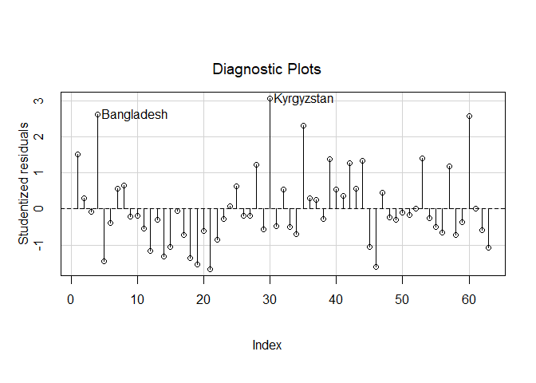
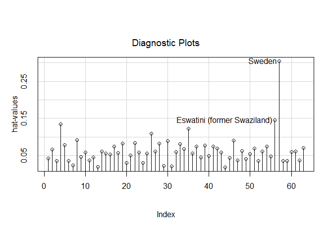
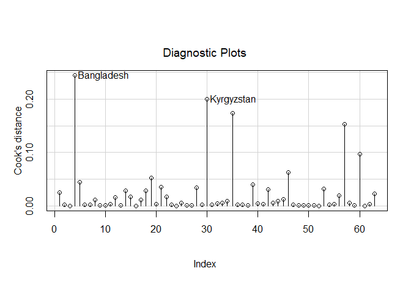
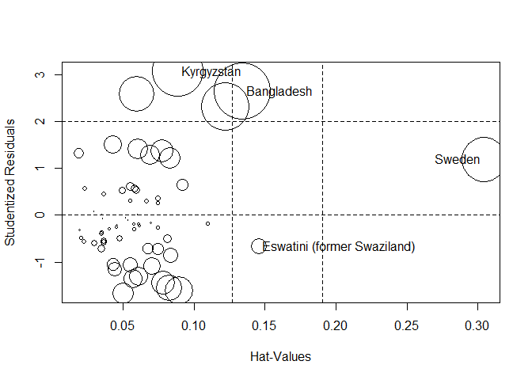
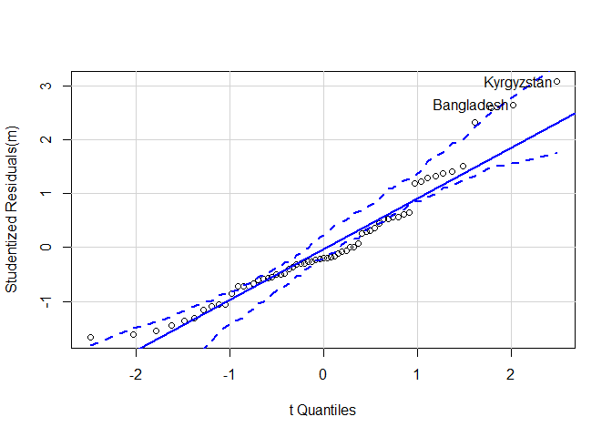
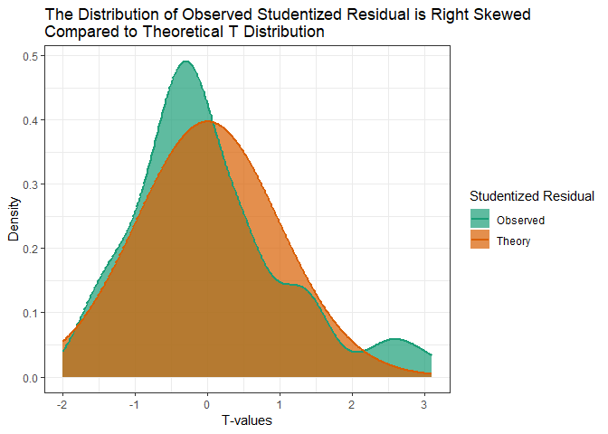
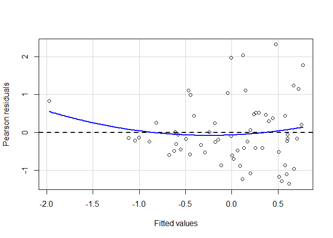
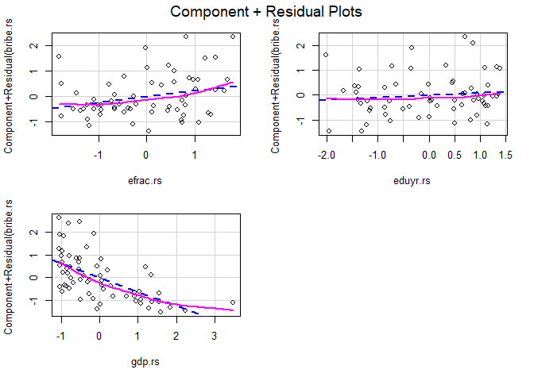

POL212 TA Session
================
Gento Kato
February 27, 2019

``` r
## Clear Workspace
rm(list = ls())

## Set Working Directory to the File location
## (If using RStudio, can be set automatically)
setwd(dirname(rstudioapi::getActiveDocumentContext()$path))
getwd()
```

    ## [1] "C:/GoogleDrive/Lectures/2019_01to03_UCD/POL212_TA/POL212_TA_resource"

``` r
## Required Package
library(readstata13)
library(haven)
```

Practice of Analysis
====================

1.  Download QOG Basic Data from <https://qog.pol.gu.se/data/datadownloads/qogbasicdata>

``` r
dtaloc <- "http://www.qogdata.pol.gu.se/data/qog_bas_cs_jan19.dta"
#dtaloc <- "D:/BoxSync/Data/QOG/basic/qog_bas_cs_jan19.dta"

d <- read_dta(dtaloc)
```

1.  Relevant Variables

``` r
nd <- data.frame(id = d$cname)
rownames(nd) <- d$cname

# bribe incidence (DV)
nd$bribe <- d$wdi_bribfirm
summary(nd$bribe)
```

    ##    Min. 1st Qu.  Median    Mean 3rd Qu.    Max.    NA's 
    ##   0.000   7.825  15.500  19.839  28.725  64.700     100

``` r
# Ethnic Fractionalization
nd$efrac <- d$al_ethnic
summary(nd$efrac)
```

    ##    Min. 1st Qu.  Median    Mean 3rd Qu.    Max.    NA's 
    ##  0.0000  0.1984  0.4303  0.4372  0.6594  0.9302       8

``` r
# Seconday Education Enrollment 
nd$eduyr <- d$wdi_ners
summary(nd$eduyr)
```

    ##    Min. 1st Qu.  Median    Mean 3rd Qu.    Max.    NA's 
    ##   4.923  56.659  80.524  71.683  90.834  99.761      53

``` r
# GDP per Capita
nd$gdp <- d$mad_gdppc
summary(nd$gdp)
```

    ##    Min. 1st Qu.  Median    Mean 3rd Qu.    Max.    NA's 
    ##     605    3624   11236   17954   25295  139542      31

``` r
# omit Missing Cases
nd <- na.omit(nd)
```

1.  Standardization

Standardize each variable in "nd" dataset. Interpret what each means.

``` r
# Standardizing 
nd$bribe.rs <- scale(nd$bribe)
summary(nd$bribe.rs)
```

    ##        V1         
    ##  Min.   :-1.2681  
    ##  1st Qu.:-0.7359  
    ##  Median :-0.2783  
    ##  Mean   : 0.0000  
    ##  3rd Qu.: 0.6675  
    ##  Max.   : 2.7860

``` r
# Does the same thing.
nd$bribe.rs <- (nd$bribe - mean(nd$bribe))/sd(nd$bribe)
summary(nd$bribe.rs)
```

    ##    Min. 1st Qu.  Median    Mean 3rd Qu.    Max. 
    ## -1.2681 -0.7359 -0.2783  0.0000  0.6675  2.7860

``` r
# Other variables
nd$efrac.rs <- scale(nd$efrac)
nd$eduyr.rs <- scale(nd$eduyr)
nd$gdp.rs <- scale(nd$gdp)
```

1.  Run OLS

Run ols model with bribe as dependent variable

``` r
m <- lm(bribe.rs ~ efrac.rs + eduyr.rs + gdp.rs, data=nd)
```

1.  Find Influencial Cases

Find influencial cases using: - Studentized residuals - hat value - Cook's distance

``` r
# Studentized Residual
influenceIndexPlot(m, vars="Studentized")
```



``` r
# Hat Value
influenceIndexPlot(m, vars="hat")
```



``` r
# Cook's D
influenceIndexPlot(m, vars="cook")
```



``` r
# All in One
influencePlot(m)
```



    ##                                StudRes        Hat     CookD
    ## Bangladesh                   2.6350553 0.13407518 0.2441765
    ## Kyrgyzstan                   3.0695087 0.08859802 0.2003747
    ## Eswatini (former Swaziland) -0.6664692 0.14568321 0.0191162
    ## Sweden                       1.1870179 0.30422554 0.1529612

Kyrgyztan, Bangladesh, Swaziland, and Sweden comes up as outliers that are influencial in predictions.

1.  Assess Models

Assess if, OLS model you estimated has: - non-normal errors - heteroskedasticity - multicollinearlity

``` r
# Check Non-normality of Residuals
qqPlot(m)
```



    ## Bangladesh Kyrgyzstan 
    ##          4         30

The error distribution is not normal. It is right skewed. Because, for the right side, observed errors (studentized residuals) tend to have larger values than the thoeretical errors that is normally distributed. You can see that in the following graph:

``` r
require(MASS)
require(ggplot2)

sr <- studres(m) # Observed Studentized Residuals
tr <- dt(seq(-2, 3.1, length=512), m$df.residual) # Theoretical Density
nn <- data.frame(x = rep(seq(-2, 3.1, length=512), 2),
                 y=c(density(sr, from=-2, to=3.1)$y, tr),
                 lab = rep(c("Observed","Theory"), each=512))
ggplot(nn, aes(x=x,y=y)) + 
  geom_ribbon(aes(ymin=0, ymax=y, fill=lab), alpha=0.7) + 
  geom_line(aes(color=lab), size=1) +
  scale_color_brewer(name="Studentized Residual", type="qual", palette=2) + 
  scale_fill_brewer(name="Studentized Residual", type="qual", palette=2) + 
  xlab("T-values") + ylab("Density") +
  ggtitle("The Distribution of Observed Studentized Residual is Right Skewed \nCompared to Theoretical T Distribution") + 
  theme_bw()
```



``` r
# Check Heteroskedasticity
residualPlots(m, ~1, fitted=TRUE, tests=FALSE)
```



There is heteroskedasticity, The variance of residuals gets larger as the predicted value of Y increases.

``` r
# Check Non-linearlity
crPlots(m, order=2)
```



For GDP, there is a sign that the relationship with bribe is non-linear.

``` r
# Check Multicollinearity
vif(m)
```

    ## efrac.rs eduyr.rs   gdp.rs 
    ## 1.331106 2.854355 3.008507

No variable has a excessive value of VIF.
