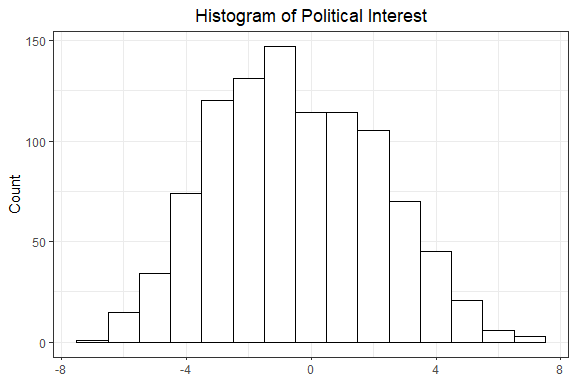
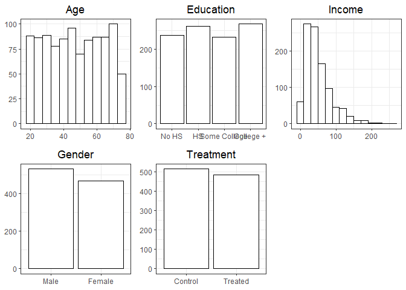
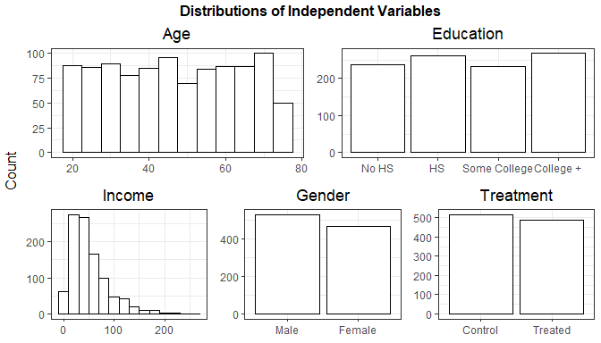
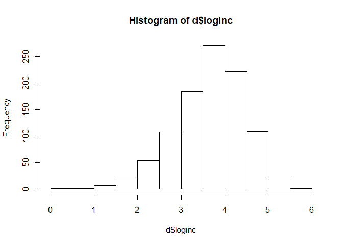
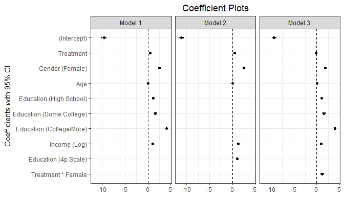
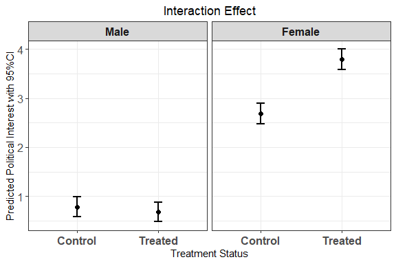

POL212 TA Session
================
Gento Kato
March 6, 2019

Preparation
===========

``` r
## Clear Workspace
rm(list = ls())

## Set Working Directory to the File location
## (If using RStudio, can be set automatically)
setwd(dirname(rstudioapi::getActiveDocumentContext()$path))
getwd()
```

    ## [1] "C:/GoogleDrive/Lectures/2019_01to03_UCD/POL212_TA/POL212_TA_resource/TA_session_030619"

``` r
## Required Packages
library(ggplot2)
library(gridExtra) # For Advanced Plotting
```

Data visualization (Using Midterm as an Example)
================================================

Load Data
---------

``` r
dloc <- "midtermdata.csv"
d <- read.csv(dloc, stringsAsFactors = FALSE)
```

Dependent Variable Distribution
-------------------------------

``` r
# Draw Histogram
dvdist <- 
  ggplot(d, aes(politicalinterest)) + 
  geom_histogram(fill = "white", # color to fill bars
                 color = "black", # color of lines
                 binwidth=1 # width of bars
                 ) +
  theme_bw() + 
  theme(plot.title=element_text(hjust=0.5)) + # center the title
  labs(x=NULL, # No xaxis label 
       y="Count",  
       title="Histogram of Political Interest") 
```

``` r
dvdist
```



``` r
ggsave("dvdist.png", dvdist, w=6, h=4)
# w is width, h is height
```

Independent Variables
---------------------

``` r
# Age
ivdist1 <- 
  ggplot(d,aes(age)) + 
  geom_histogram(fill="white",color="black",binwidth=5) + 
  theme_bw() + 
  theme(plot.title=element_text(hjust=0.5)) + 
  labs(x=NULL,y=NULL,title="Age")

# Education
# Define Levels of Factor
d$education <- factor(d$education,
                      levels=c("No HS","HS",
                               "Some College","College +"))
ivdist2 <- 
  ggplot(d,aes(education)) + 
  geom_bar(fill="white",color="black") + # Bar Graph (Since Categorical)
  theme_bw() + 
  theme(plot.title=element_text(hjust=0.5)) + 
  labs(x=NULL,y=NULL,title="Education")

# Income
ivdist3 <- 
  ggplot(d,aes(income)) + 
  geom_histogram(fill="white",color="black",binwidth=20) + 
  theme_bw() + 
  theme(plot.title=element_text(hjust=0.5)) + 
  labs(x=NULL,y=NULL,title="Income")

# Female

# Create New Variable for Plotting
d$fem_fac <- ifelse(d$female==1,"Female","Male")
d$fem_fac <- factor(d$fem_fac,levels=c("Male","Female"))

ivdist4 <- 
  ggplot(d,aes(fem_fac)) + 
  geom_bar(fill="white",color="black") + # Bar Graph (Since Categorical)
  theme_bw() + 
  theme(plot.title=element_text(hjust=0.5)) + 
  labs(x=NULL,y=NULL,title="Gender")

# Treatment

# Create New Variable for Plotting
d$treat_fac <- ifelse(d$treatment==1,"Treated","Control")
d$treat_fac <- factor(d$treat_fac,levels=c("Control","Treated"))

ivdist5 <- 
  ggplot(d,aes(treat_fac)) + 
  geom_bar(fill="white",color="black") + # Bar Graph (Since Categorical)
  theme_bw() + 
  theme(plot.title=element_text(hjust=0.5)) + 
  labs(x=NULL,y=NULL,title="Treatment")


# Combine Plots
ivdist <- arrangeGrob(ivdist1,ivdist2,ivdist3,
                      ivdist4,ivdist5,ncol=3)
grid.arrange(ivdist)
```



``` r
# More Advanced
ivdist <- arrangeGrob(ivdist1,ivdist2,ivdist3,ivdist4,ivdist5,
             layout_matrix = rbind(c(1,1,1,2,2,2),  # Plot Only Two Panels in 1st Row
                                   c(3,3,4,4,5,5)), # Plot Three Panels in 2nd Row
             top = textGrob("Distributions of Independent Variables", # Title
                            gp=gpar(fontface="bold")), # Use Bold Font
             left = "Count"
             ) 
```

``` r
grid.arrange(ivdist) # Use grid.arrange to plot arrangeGrob
```



``` r
# Save
ggsave("ivdist.png", ivdist, w=7, h=4)
```

Transform Variables
-------------------

``` r
# Numeric Education
d$edunum <- as.numeric(d$education)

# Logged Income
d$loginc <- log(d$income)
hist(d$loginc)
```



Run OLS
-------

``` r
# Without Interaction
m <- lm(politicalinterest ~ treatment + female + age + education + loginc,
        data = d)
# With Numeric Education
mn <- lm(politicalinterest ~ treatment + female + age + edunum + loginc,
        data = d)
# Interacted with Female
mi <- lm(politicalinterest ~ treatment*female + age + education + loginc,
        data = d)

# Show Results Temporarily
summary(m)
```

    ## 
    ## Call:
    ## lm(formula = politicalinterest ~ treatment + female + age + education + 
    ##     loginc, data = d)
    ## 
    ## Residuals:
    ##     Min      1Q  Median      3Q     Max 
    ## -4.0638 -0.8761 -0.0022  0.8215  4.2267 
    ## 
    ## Coefficients:
    ##                        Estimate Std. Error t value Pr(>|t|)    
    ## (Intercept)           -9.646736   0.246724 -39.099  < 2e-16 ***
    ## treatment              0.460445   0.083417   5.520 4.33e-08 ***
    ## female                 2.482523   0.083409  29.763  < 2e-16 ***
    ## age                    0.049986   0.002462  20.303  < 2e-16 ***
    ## educationHS            1.167857   0.117690   9.923  < 2e-16 ***
    ## educationSome College  1.612902   0.121296  13.297  < 2e-16 ***
    ## educationCollege +     4.099461   0.117366  34.929  < 2e-16 ***
    ## loginc                 1.008511   0.052637  19.160  < 2e-16 ***
    ## ---
    ## Signif. codes:  0 '***' 0.001 '**' 0.01 '*' 0.05 '.' 0.1 ' ' 1
    ## 
    ## Residual standard error: 1.311 on 992 degrees of freedom
    ## Multiple R-squared:  0.7508, Adjusted R-squared:  0.749 
    ## F-statistic: 426.9 on 7 and 992 DF,  p-value: < 2.2e-16

``` r
summary(mn)
```

    ## 
    ## Call:
    ## lm(formula = politicalinterest ~ treatment + female + age + edunum + 
    ##     loginc, data = d)
    ## 
    ## Residuals:
    ##     Min      1Q  Median      3Q     Max 
    ## -4.8510 -0.9190 -0.0078  0.9483  4.3097 
    ## 
    ## Coefficients:
    ##               Estimate Std. Error t value Pr(>|t|)    
    ## (Intercept) -11.183130   0.268818 -41.601  < 2e-16 ***
    ## treatment     0.461113   0.087942   5.243 1.93e-07 ***
    ## female        2.508613   0.087964  28.519  < 2e-16 ***
    ## age           0.050152   0.002598  19.308  < 2e-16 ***
    ## edunum        1.292136   0.039181  32.978  < 2e-16 ***
    ## loginc        1.015298   0.055541  18.280  < 2e-16 ***
    ## ---
    ## Signif. codes:  0 '***' 0.001 '**' 0.01 '*' 0.05 '.' 0.1 ' ' 1
    ## 
    ## Residual standard error: 1.383 on 994 degrees of freedom
    ## Multiple R-squared:  0.7219, Adjusted R-squared:  0.7205 
    ## F-statistic:   516 on 5 and 994 DF,  p-value: < 2.2e-16

``` r
summary(mi)
```

    ## 
    ## Call:
    ## lm(formula = politicalinterest ~ treatment * female + age + education + 
    ##     loginc, data = d)
    ## 
    ## Residuals:
    ##     Min      1Q  Median      3Q     Max 
    ## -3.7804 -0.8562  0.0333  0.8382  3.9479 
    ## 
    ## Coefficients:
    ##                        Estimate Std. Error t value Pr(>|t|)    
    ## (Intercept)           -9.315785   0.244463 -38.107  < 2e-16 ***
    ## treatment             -0.099931   0.111165  -0.899    0.369    
    ## female                 1.902865   0.112957  16.846  < 2e-16 ***
    ## age                    0.049599   0.002399  20.677  < 2e-16 ***
    ## educationHS            1.114394   0.114864   9.702  < 2e-16 ***
    ## educationSome College  1.575145   0.118259  13.319  < 2e-16 ***
    ## educationCollege +     4.019797   0.114828  35.007  < 2e-16 ***
    ## loginc                 1.013879   0.051276  19.773  < 2e-16 ***
    ## treatment:female       1.204228   0.163033   7.386  3.2e-13 ***
    ## ---
    ## Signif. codes:  0 '***' 0.001 '**' 0.01 '*' 0.05 '.' 0.1 ' ' 1
    ## 
    ## Residual standard error: 1.277 on 991 degrees of freedom
    ## Multiple R-squared:  0.7638, Adjusted R-squared:  0.7619 
    ## F-statistic: 400.5 on 8 and 991 DF,  p-value: < 2.2e-16

Visualize OLS Estimates
-----------------------

``` r
# 1st: APSR Table

library(apsrtable)
# Start
apsrtable(m,mn,mi)
```

    ## \begin{table}[!ht]
    ## \caption{}
    ## \label{} 
    ## \begin{tabular}{ l D{.}{.}{2}D{.}{.}{2}D{.}{.}{2} } 
    ## \hline 
    ##   & \multicolumn{ 1 }{ c }{ Model 1 } & \multicolumn{ 1 }{ c }{ Model 2 } & \multicolumn{ 1 }{ c }{ Model 3 } \\ \hline
    ##  %                     & Model 1   & Model 2   & Model 3  \\ 
    ## (Intercept)           & -9.65 ^*  & -11.18 ^* & -9.32 ^* \\ 
    ##                       & (0.25)    & (0.27)    & (0.24)   \\ 
    ## treatment             & 0.46 ^*   & 0.46 ^*   & -0.10    \\ 
    ##                       & (0.08)    & (0.09)    & (0.11)   \\ 
    ## female                & 2.48 ^*   & 2.51 ^*   & 1.90 ^*  \\ 
    ##                       & (0.08)    & (0.09)    & (0.11)   \\ 
    ## age                   & 0.05 ^*   & 0.05 ^*   & 0.05 ^*  \\ 
    ##                       & (0.00)    & (0.00)    & (0.00)   \\ 
    ## educationHS           & 1.17 ^*   &           & 1.11 ^*  \\ 
    ##                       & (0.12)    &           & (0.11)   \\ 
    ## educationSome College & 1.61 ^*   &           & 1.58 ^*  \\ 
    ##                       & (0.12)    &           & (0.12)   \\ 
    ## educationCollege +    & 4.10 ^*   &           & 4.02 ^*  \\ 
    ##                       & (0.12)    &           & (0.11)   \\ 
    ## loginc                & 1.01 ^*   & 1.02 ^*   & 1.01 ^*  \\ 
    ##                       & (0.05)    & (0.06)    & (0.05)   \\ 
    ## edunum                &           & 1.29 ^*   &          \\ 
    ##                       &           & (0.04)    &          \\ 
    ## treatment:female      &           &           & 1.20 ^*  \\ 
    ##                       &           &           & (0.16)    \\
    ##  $N$                   & 1000      & 1000      & 1000     \\ 
    ## $R^2$                 & 0.75      & 0.72      & 0.76     \\ 
    ## adj. $R^2$            & 0.75      & 0.72      & 0.76     \\ 
    ## Resid. sd             & 1.31      & 1.38      & 1.28      \\ \hline
    ##  \multicolumn{4}{l}{\footnotesize{Standard errors in parentheses}}\\
    ## \multicolumn{4}{l}{\footnotesize{$^*$ indicates significance at $p< 0.05 $}} 
    ## \end{tabular} 
    ##  \end{table}

``` r
# More Advanced (Save File)
cn <- c("(Intercept)","Treatment",
        "Gender (Female)", "Age",
        "Education (High School)",
        "Education (Some College)",
        "Education (College/More)",
        "Income (Log)",
        "Education (4p Scale)",
        "Treatment * Female")
tabout1 <- 
  apsrtable(m,mn,mi,
            coef.names = cn, # Custom Coefficient Names
            digits = 3, # Number of Digits in Output
            coef.rows = 1, # Single Row for Coefficient (Can also be 2)
            Sweave = TRUE # Only Tabular
            ) # Appear in LaTex File
# Save File 
cat(tabout1, file="apsrtable_out.tex")

# 2nd: texreg

library(texreg)

# Default
texreg(list(m,mn,mi))
```

    ## 
    ## \begin{table}
    ## \begin{center}
    ## \begin{tabular}{l c c c }
    ## \hline
    ##  & Model 1 & Model 2 & Model 3 \\
    ## \hline
    ## (Intercept)           & $-9.65^{***}$ & $-11.18^{***}$ & $-9.32^{***}$ \\
    ##                       & $(0.25)$      & $(0.27)$       & $(0.24)$      \\
    ## treatment             & $0.46^{***}$  & $0.46^{***}$   & $-0.10$       \\
    ##                       & $(0.08)$      & $(0.09)$       & $(0.11)$      \\
    ## female                & $2.48^{***}$  & $2.51^{***}$   & $1.90^{***}$  \\
    ##                       & $(0.08)$      & $(0.09)$       & $(0.11)$      \\
    ## age                   & $0.05^{***}$  & $0.05^{***}$   & $0.05^{***}$  \\
    ##                       & $(0.00)$      & $(0.00)$       & $(0.00)$      \\
    ## educationHS           & $1.17^{***}$  &                & $1.11^{***}$  \\
    ##                       & $(0.12)$      &                & $(0.11)$      \\
    ## educationSome College & $1.61^{***}$  &                & $1.58^{***}$  \\
    ##                       & $(0.12)$      &                & $(0.12)$      \\
    ## educationCollege +    & $4.10^{***}$  &                & $4.02^{***}$  \\
    ##                       & $(0.12)$      &                & $(0.11)$      \\
    ## loginc                & $1.01^{***}$  & $1.02^{***}$   & $1.01^{***}$  \\
    ##                       & $(0.05)$      & $(0.06)$       & $(0.05)$      \\
    ## edunum                &               & $1.29^{***}$   &               \\
    ##                       &               & $(0.04)$       &               \\
    ## treatment:female      &               &                & $1.20^{***}$  \\
    ##                       &               &                & $(0.16)$      \\
    ## \hline
    ## R$^2$                 & 0.75          & 0.72           & 0.76          \\
    ## Adj. R$^2$            & 0.75          & 0.72           & 0.76          \\
    ## Num. obs.             & 1000          & 1000           & 1000          \\
    ## RMSE                  & 1.31          & 1.38           & 1.28          \\
    ## \hline
    ## \multicolumn{4}{l}{\scriptsize{$^{***}p<0.001$, $^{**}p<0.01$, $^*p<0.05$}}
    ## \end{tabular}
    ## \caption{Statistical models}
    ## \label{table:coefficients}
    ## \end{center}
    ## \end{table}

``` r
# Advanced
texreg(list(m,mn,mi),
      file = "texreg_out.tex", # Write in specified file
      custom.coef.names = cn, # Change Coefficient Names
      reorder.coef = c(1,2,3,10,4,5,6,7,9,8), # Change Orde of Coefs 
      single.row = TRUE, # Present coefficients in single row
      booktabs = TRUE, use.packages=FALSE, # Advanced formatting
      table = FALSE # Just present tabular
      )
```

    ## The table was written to the file 'texreg_out.tex'.

``` r
# Word Format
htmlreg(list(m,mn,mi),
       file = "texreg_out.doc", # Write in specified file
       custom.coef.names = cn, # Change Coefficient Names
       reorder.coef = c(1,2,3,10,4,5,6,7,9,8), # Change Orde of Coefs 
       single.row = TRUE, # Present coefficients in single row
       caption = "OLS Estimates",
       caption.above = TRUE # Put caption above the table
       )
```

    ## The table was written to the file 'texreg_out.doc'.

``` r
# 3rd: coefficient plot

library(lmtest)
cpd1 <- as.data.frame(cbind(m$coefficients,coefci(m)))
cpd2 <- as.data.frame(cbind(mn$coefficients,coefci(mn)))
cpd3 <- as.data.frame(cbind(mi$coefficients,coefci(mi)))
cpd1$cn <- cn[-c(9,10)]
cpd2$cn <- cn[-c(5,6,7,10)]
cpd3$cn <- cn[-9]
cpd1$mname <- "Model 1"
cpd2$mname <- "Model 2"
cpd3$mname <- "Model 3"
cpd <- rbind(cpd1,cpd2,cpd3)
names(cpd) <- c("cf","lCI","uCI","cn","mname")
# Rownames as Coefficient Names (Order reversed for later purpose)
cpd$cn <- factor(cpd$cn,
                 levels=rev(unique(cpd$cn)))
cp <- ggplot(cpd, aes(x=cn,y=cf)) + 
  geom_hline(aes(yintercept=0), linetype=2) + 
  geom_point() + 
  geom_errorbar(aes(ymin=lCI,ymax=uCI), width=0.1)+ 
  facet_grid(.~mname) + 
  coord_flip() + theme_bw() + 
  theme(plot.title=element_text(hjust=0.5)) + 
  labs(title="Coefficient Plots",
       x = "Coefficients with 95% CI", y = NULL)
```

``` r
cp
```



``` r
# Save
ggsave("cp.png", cp, w=7, h=4)
```

Interaction
-----------

``` r
prof <- data.frame(treatment=c(0,1,0,1),
                   female = c(0,0,1,1),
                   education = "College +",
                   age = median(d$age),
                   loginc = median(d$loginc)
                   )
prof
```

    ##   treatment female education     age   loginc
    ## 1         0      0 College + 46.5045 3.719929
    ## 2         1      0 College + 46.5045 3.719929
    ## 3         0      1 College + 46.5045 3.719929
    ## 4         1      1 College + 46.5045 3.719929

``` r
pred <- predict(mi, newdata=prof, 
        se.fit = TRUE)
pred
```

    ## $fit
    ##         1         2         3         4 
    ## 0.7821520 0.6822206 2.6850170 3.7893140 
    ## 
    ## $se.fit
    ##         1         2         3         4 
    ## 0.1040580 0.1032123 0.1070660 0.1071855 
    ## 
    ## $df
    ## [1] 991
    ## 
    ## $residual.scale
    ## [1] 1.276692

``` r
prd <- data.frame(est = pred$fit,
                  lCI = pred$fit - 1.96*pred$se.fit,
                  uCI = pred$fit + 1.96*pred$se.fit)
prd$gender <- factor(c("Male","Male","Female","Female"),
                     levels=c("Male","Female"))
prd$treat <- factor(c("Control","Treated","Control","Treated"),
                    levels=c("Control","Treated"))

pri <- ggplot(prd, aes(x=treat, y=est)) + 
  geom_point(aes(color=treat), 
             position=position_dodge(width=0.5), # Jittering location of points
             size = 2 # Size of point 
             ) + 
  geom_errorbar(aes(ymin=lCI,ymax=uCI, color=treat), 
                width=0.1, # wdith of horizontal line
                size = 0.8, # thickness of line
                position=position_dodge(width=0.5))+ 
  facet_grid(.~gender, scales="free_x") + # Split panels by gender
  scale_color_manual(name="Treatment",values=c(1,1)) + # Both Black Lines
  theme_bw() + 
  theme(plot.title = element_text(hjust=0.5),
        legend.position = "none", # Do NOT SHOW LEGEND
        axis.text.y = element_text(size=12), 
        axis.text.x = element_text(size=12, face="bold"),
        strip.text = element_text(size=12, face="bold")) + 
  labs(title="Interaction Effect",
       x = "Treatment Status", y = "Predicted Political Interest with 95%CI")
```

``` r
pri
```



``` r
# Save
ggsave("pri.png", pri, w=7, h=4)
```
